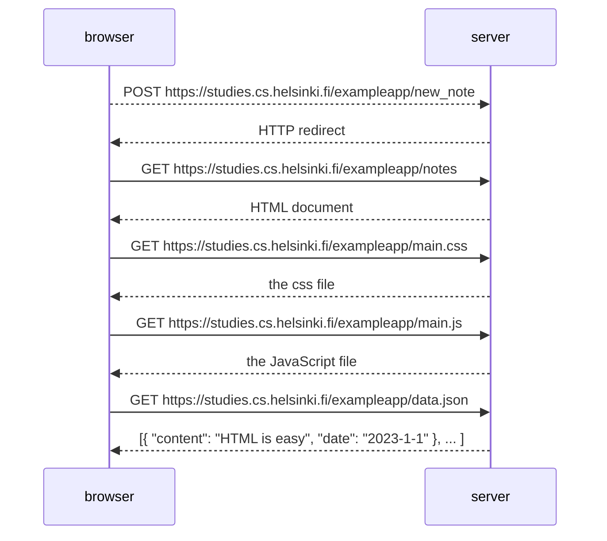
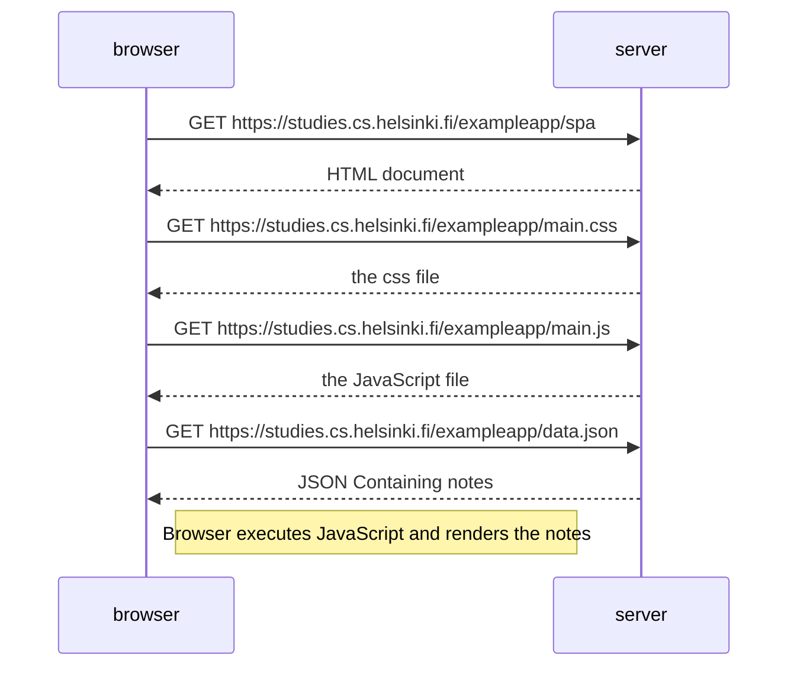

#Part0

## 0.4: New note diagram

```mermaid
sequenceDiagram
    participant browser
    participant server
    browser-->>server: POST https://studies.cs.helsinki.fi/exampleapp/new_note
    server-->>browser: HTTP redirect
    browser->>server: GET https://studies.cs.helsinki.fi/exampleapp/notes
    
    server-->>browser: HTML document

    browser->>server: GET https://studies.cs.helsinki.fi/exampleapp/main.css
    
    server-->>browser: the css file

    browser->>server: GET https://studies.cs.helsinki.fi/exampleapp/main.js
    
    server-->>browser: the JavaScript file
    

    browser->>server: GET https://studies.cs.helsinki.fi/exampleapp/data.json

    server-->>browser: [{ "content": "HTML is easy", "date": "2023-1-1" }, ... ]
```

## 0.5: Single page app diagram

```mermaid
sequenceDiagram
    participant browser
    participant server
    browser->>server: GET https://studies.cs.helsinki.fi/exampleapp/spa
    
    server-->>browser: HTML document

    browser->>server: GET https://studies.cs.helsinki.fi/exampleapp/main.css
    
    server-->>browser: the css file

    browser->>server: GET https://studies.cs.helsinki.fi/exampleapp/main.js
    
    server-->>browser: the JavaScript file
    

    browser->>server: GET https://studies.cs.helsinki.fi/exampleapp/data.json

    server-->>browser: JSON Containing notes
    Note right of browser: Browser executes JavaScript and renders the notes
```

